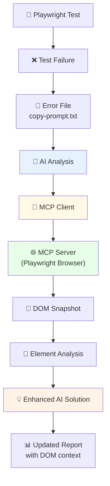

# 🔌 MCP Integration Guide

**Model Context Protocol (MCP) интеграция для получения структурированной информации о DOM**

## 🎯 Что такое MCP?

**Model Context Protocol (MCP)** - это стандарт для подключения AI моделей к внешним системам и инструментам. В контексте Playwright AI Auto-Debug, MCP обеспечивает:

- 📸 **DOM snapshots** - снимки структуры страницы в реальном времени
- 🧪 **Browser automation** - валидация действий через MCP сервер
- 🎯 **Точные селекторы** - анализ на основе актуальной структуры DOM

## 🚀 Быстрый старт с MCP

### 1. Включение MCP в конфигурации

```javascript
// ai.conf.js
export const ai_conf = {
  api_key: 'your-api-key',
  
  // MCP настройки
  mcp_integration: true,
  mcp_ws_host: 'localhost',
  mcp_ws_port: 3001,
  mcp_timeout: 30000
};
```

### 2. Запуск с MCP

```bash
# Обычный режим
npx playwright-ai

# Режим с MCP DOM snapshots
npx playwright-ai --use-mcp
```

## 🏗️ Архитектура MCP интеграции



## 🔧 Подробная конфигурация MCP

### Основные параметры

```javascript
// ai.conf.js
export const ai_conf = {
  // Обязательные параметры
  api_key: 'your-api-key',
  
  // MCP интеграция
  mcp_integration: true,              // Включить MCP
  mcp_ws_host: 'localhost',           // Хост MCP сервера
  mcp_ws_port: 3001,                  // Порт MCP сервера
  mcp_timeout: 30000,                 // Таймаут соединения (мс)
  
  // Дополнительные настройки
  mcp_retry_attempts: 3,              // Количество попыток подключения
  mcp_retry_delay: 1000,              // Задержка между попытками
  mcp_snapshot_format: 'accessibility' // Формат snapshot'а
};
```

### Продвинутые настройки

```javascript
export const ai_conf = {
  api_key: 'your-key',
  mcp_integration: true,
  
  // Настройки snapshot'ов
  mcp_snapshot_options: {
    includeInvisible: false,          // Включать невидимые элементы
    maxDepth: 10,                     // Максимальная глубина DOM
    includeStyles: true,              // Включать CSS стили
    includeAttributes: ['id', 'class', 'data-testid']
  },
  
  // Фильтрация элементов
  mcp_element_filters: {
    excludeTagNames: ['script', 'style', 'meta'],
    includeInteractive: true,         // Только интерактивные элементы
    minTextLength: 3                  // Минимальная длина текста
  }
};
```

## 📸 Типы DOM Snapshots

### 1. Accessibility Tree (по умолчанию)
```javascript
mcp_snapshot_format: 'accessibility'
```
- Фокус на доступности и интерактивных элементах
- Оптимален для анализа проблем с селекторами
- Меньший размер данных

### 2. Full DOM Tree
```javascript
mcp_snapshot_format: 'full'
```
- Полная структура DOM
- Включает все элементы и атрибуты
- Больше контекста, но больше данных

### 3. Interactive Elements Only
```javascript
mcp_snapshot_format: 'interactive'
```
- Только кликабельные и вводимые элементы
- Оптимален для тестов пользовательского интерфейса
- Минимальный размер данных

## 🎯 Примеры использования

### Анализ проблем с селекторами

Когда тест падает с ошибкой "Element not found", MCP предоставляет:

```
🔍 DOM Snapshot Analysis:
Available elements on page:
- button[data-testid="login-btn"] ✅
- input[placeholder="Email"] ✅
- div.error-message (hidden) ❌

💡 AI Solution with MCP context:
The selector 'button[data-testid="submit"]' is not found because 
the actual element has data-testid="login-btn". Update your test:

await page.click('button[data-testid="login-btn"]');
```

### Валидация состояния страницы

MCP помогает ИИ понять контекст:

```
📸 Page State from MCP:
- Form is visible: ✅
- Submit button is enabled: ❌
- Error message: "Please fill required fields"

💡 Enhanced AI Analysis:
The test fails because submit button is disabled due to validation.
Add field filling before clicking submit:

await page.fill('input[name="email"]', 'test@example.com');
await page.fill('input[name="password"]', 'password123');
await page.click('button[type="submit"]');
```

## 🔄 Жизненный цикл MCP запроса

1. **Обнаружение ошибки** - плагин находит файл с ошибкой теста
2. **Анализ контекста** - определяет необходимость DOM snapshot'а
3. **MCP подключение** - устанавливает WebSocket соединение
4. **Получение snapshot'а** - запрашивает текущее состояние DOM
5. **AI анализ** - отправляет ошибку + DOM контекст в ИИ
6. **Генерация решения** - ИИ создает решение с учетом реального DOM
7. **Обновление отчета** - добавляет решение в HTML/Allure отчеты

## 🔌 Настройка MCP сервера

### Playwright MCP Server

```javascript
// playwright.config.js
export default defineConfig({
  // Основные настройки Playwright
  testDir: './tests',
  reporter: 'html',
  
  // MCP сервер (автоматически запускается)
  globalSetup: './global-setup.js',
  globalTeardown: './global-teardown.js'
});
```

### Кастомный MCP сервер

```javascript
// mcp-server.js
import { McpServer } from '@playwright-ai/mcp-server';

const server = new McpServer({
  port: 3001,
  host: 'localhost',
  enableSnapshots: true,
  snapshotFormat: 'accessibility'
});

await server.start();
```

## 🧪 Тестирование MCP интеграции

### Проверка подключения

```bash
# Проверить доступность MCP сервера
npx playwright-ai --test-mcp-connection
```

### Получение тестового snapshot'а

```bash
# Получить snapshot текущей страницы
npx playwright-ai --get-mcp-snapshot
```

### Демо с MCP

```bash
cd DemoProject
npm run demo:ui-coverage  # Демо с MCP интеграцией
```

## 🔍 Отладка MCP

### Включение debug логов

```javascript
// ai.conf.js
export const ai_conf = {
  api_key: 'your-key',
  mcp_integration: true,
  mcp_debug: true,  // Включить подробные логи
  mcp_log_level: 'debug'
};
```

### Логи MCP подключения

```bash
🔌 Connecting to MCP server at ws://localhost:3001
✅ MCP connection established
📸 Requesting DOM snapshot...
📊 Snapshot received: 156 elements
🤖 Sending enhanced prompt to AI...
```

### Типичные ошибки MCP

| Ошибка | Причина | Решение |
|--------|---------|---------|
| `Connection refused` | MCP сервер не запущен | Проверьте порт 3001 |
| `Timeout waiting for snapshot` | Медленная страница | Увеличьте `mcp_timeout` |
| `Invalid snapshot format` | Неверный формат | Проверьте `mcp_snapshot_format` |

## 🎯 Лучшие практики

### 1. Когда использовать MCP
- ✅ Сложные динамические страницы
- ✅ Проблемы с селекторами
- ✅ Анализ состояния элементов
- ❌ Простые статические тесты

### 2. Оптимизация производительности
```javascript
// Используйте фильтры для уменьшения размера snapshot'ов
mcp_element_filters: {
  includeInteractive: true,
  excludeTagNames: ['script', 'style', 'meta'],
  maxElements: 200
}
```

### 3. Безопасность
- Не включайте чувствительные данные в snapshot'ы
- Используйте фильтры для исключения приватной информации
- Ограничивайте доступ к MCP серверу

## 🔄 Интеграция с CI/CD

### GitHub Actions

```yaml
# .github/workflows/test.yml
- name: Run Playwright tests
  run: npx playwright test

- name: AI analysis with MCP
  run: npx playwright-ai --use-mcp
  env:
    API_KEY: ${{ secrets.MISTRAL_API_KEY }}
```

### Jenkins

```groovy
stage('AI Debug Analysis') {
  steps {
    sh 'npx playwright-ai --use-mcp'
  }
  post {
    always {
      publishHTML([
        allowMissing: false,
        alwaysLinkToLastBuild: true,
        keepAll: true,
        reportDir: 'playwright-report',
        reportFiles: 'index.html',
        reportName: 'Playwright Report with AI'
      ])
    }
  }
}
```

## 📊 Мониторинг MCP

### Метрики MCP интеграции

```javascript
// Получение статистики MCP
const mcpStats = await mcpClient.getStats();
console.log(`Snapshots requested: ${mcpStats.snapshotsRequested}`);
console.log(`Average response time: ${mcpStats.avgResponseTime}ms`);
console.log(`Success rate: ${mcpStats.successRate}%`);
```

### Health Check

```bash
# Проверка состояния MCP
npx playwright-ai --mcp-health-check
```

## 🚀 Следующие шаги

1. **Изучите демо**: `cd DemoProject && npm run demo:ui-coverage`
2. **Настройте под ваш проект**: адаптируйте конфигурацию MCP
3. **Интегрируйте в CI/CD**: добавьте MCP анализ в pipeline
4. **Мониторинг**: настройте отслеживание метрик MCP

---

**🔌 MCP Integration делает AI анализ более точным и контекстуальным**
